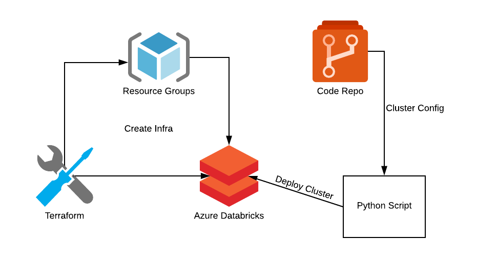
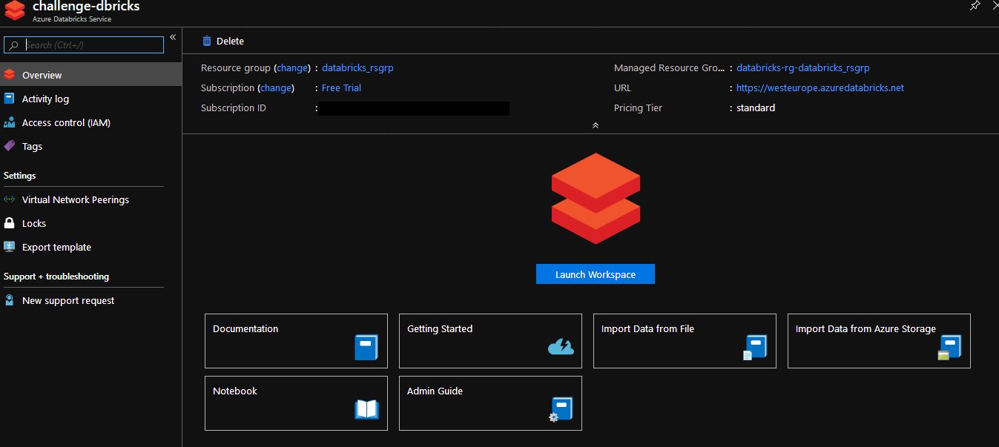
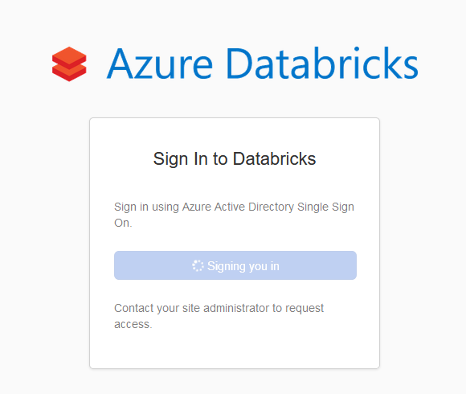
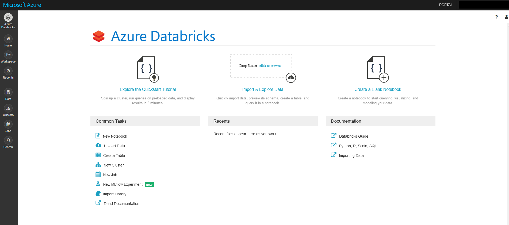
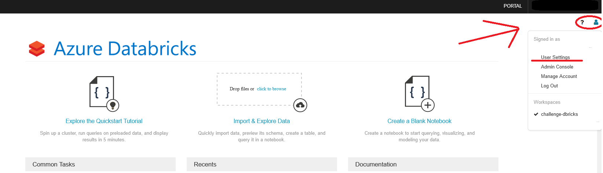
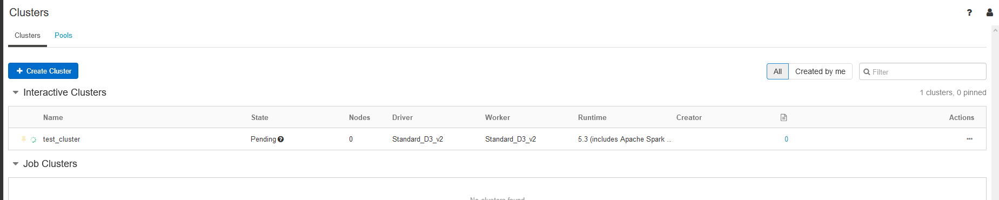

# Solution 1 - Azure DataBricks

This solution is the fasted way to deploy an Apache Sparks cluster on Azure. It can be used for simple Proof-of-concept solutions or when your analytics engine is the least important part. It could also be used for cheap, disposable infrastructure for non-production environments.

We build an Azure DataBricks Workspace via Terraform and we script the creation of an Apache Sparks cluster. The script that builds the cluster can be integrated in a CICD pipeline, in order to create the environment automatically on code commit.



---

## Requirements

* Azure account
* Python 3.X
* PowerShell and Azure CLI
* [Terraform 0.12.X](https://www.terraform.io/)

---

## Setup

### PowerShell

You will need to download the [Azure CLI](https://docs.microsoft.com/en-us/cli/azure/install-azure-cli?view=azure-cli-latest)

### Terraform

You will need to install [Terraform](https://www.terraform.io/downloads.html)

### Credentials

To use Azure in a script you need to generate CLI credentials, that will include the *Azure Tenant ID*, *Azure Subscription ID*, *Azure App ID* and *Azure App Secret*.

On your PowerShell console, run the following command:

```powershell
az login
```

It will open a browser window where you will use your username and password, for your Azure account. If it is successful, it will show something like this:

```powershell
You have logged in. Now let us find all the subscriptions to which you have access...
[
  {
    "cloudName": "AzureCloud",
    "id": "xxx-xx-xxx-xxx",
    "isDefault": true,
    "name": "Free Trial",
    "state": "Enabled",
    "tenantId": "xxxx-xxxx-xxx-xxxx-xxxx",
    "user": {
      "name": "jo......@.....com",
      "type": "user"
    }
  }
]
```

Save the `id` field and `tenantId`. The `id` represents your *Subscription ID* and the `tenantId` represents your *Tenant ID.*

Then you'll need to create the *App Service Principal*. Run the following command:

```powershell
az ad sp create-for-rbac --role="Contributor" --scopes="/subscriptions/<subscription_id>"
```

If the operation is sucessful, the output will be something like this:

```json
{
  "appId": "xxx-xxxx-xxxx-xxxx-xxx-xxx",
  "displayName": "<service principal name>",
  "name": "http://<service principal name>",
  "password": "xxxxx--xxxx-xxxx-xxxx",
  "tenant": "xxxxx--xxxx-xxxx-xxxx"
}
```

Save the `appId` field and `password`. The `appId` represents your *Application ID* and the `password` represents your *Application Secret*.

Create a file with the following format:

```ini
subscription_id = "<Subscription ID>"
client_id = "<Application ID>"
client_secret = "<Password>"
tenant_id = "<Tenant ID>"
```

To test the credentials you can run the following command:

```powershell
az login --service-principal -u <client_id> -p <client_secret> --tenant <tenant_id>
```

**Note:** You may need to set yourself as the owner of the application. This should not be needed in an environment with Azure AD but if you're not able to access your resources after they are created, add your user as owner of the application. To do that, go to `Azure Active Directory > Enterprise Applications`, select *All Applications* and type your application name. On the owners tab, add your user to it.

---

## Creating the Azure Infrastructure

To deploy the DataBricks workspace you'll need Terraform for the following steps.

Initialize and download the modules:

```powershell
terraform init
```

Test your configuration before deploying it. Don't forget to pass it the credentials file:

```powershell
terraform plan -var-file=<credentials_file>
```

The output should be similar to this:

```powershell
terraform plan -var-file="..\..\credentials"
Refreshing Terraform state in-memory prior to plan...
The refreshed state will be used to calculate this plan, but will not be
persisted to local or remote state storage.


------------------------------------------------------------------------

An execution plan has been generated and is shown below.
Resource actions are indicated with the following symbols:
  + create

Terraform will perform the following actions:

  # azurerm_databricks_workspace.db_workspace will be created
  + resource "azurerm_databricks_workspace" "db_workspace" {
      + id                          = (known after apply)
      + location                    = "westeurope"
      + managed_resource_group_id   = (known after apply)
      + managed_resource_group_name = (known after apply)
      + name                        = "challenge-dbricks"
      + resource_group_name         = "databricks_rsgrp"
      + sku                         = "standard"
      + tags                        = (known after apply)
    }

  # azurerm_resource_group.databricks_rs_grp will be created
  + resource "azurerm_resource_group" "databricks_rs_grp" {
      + id       = (known after apply)
      + location = "westeurope"
      + name     = "databricks_rsgrp"
      + tags     = (known after apply)
    }

Plan: 2 to add, 0 to change, 0 to destroy.

------------------------------------------------------------------------

Note: You didn't specify an "-out" parameter to save this plan, so Terraform
can't guarantee that exactly these actions will be performed if
"terraform apply" is subsequently run.
```

Apply the configuration to your Azure cloud (don't forget to confirm it!!):

```powershell
terraform apply -var-file=<credentials_file>
```

The output should be similar to this:

```powershell
...

Do you want to perform these actions?
  Terraform will perform the actions described above.
  Only 'yes' will be accepted to approve.

  Enter a value: yes

azurerm_resource_group.databricks_rs_grp: Creating...
azurerm_resource_group.databricks_rs_grp: Creation complete after 1s [id=/subscriptions/xxxx-xxxx-xxxx-xxxx/resourceGroups/databricks_rsgrp]
azurerm_databricks_workspace.db_workspace: Creating...
azurerm_databricks_workspace.db_workspace: Still creating... [10s elapsed]
azurerm_databricks_workspace.db_workspace: Still creating... [20s elapsed]
azurerm_databricks_workspace.db_workspace: Still creating... [30s elapsed]
azurerm_databricks_workspace.db_workspace: Still creating... [40s elapsed]
azurerm_databricks_workspace.db_workspace: Still creating... [50s elapsed]
azurerm_databricks_workspace.db_workspace: Still creating... [1m0s elapsed]
azurerm_databricks_workspace.db_workspace: Still creating... [1m10s elapsed]
azurerm_databricks_workspace.db_workspace: Still creating... [1m20s elapsed]
azurerm_databricks_workspace.db_workspace: Still creating... [1m30s elapsed]
azurerm_databricks_workspace.db_workspace: Still creating... [1m40s elapsed]
azurerm_databricks_workspace.db_workspace: Still creating... [1m50s elapsed]
azurerm_databricks_workspace.db_workspace: Still creating... [2m0s elapsed]
azurerm_databricks_workspace.db_workspace: Creation complete after 2m2s [id=/subscriptions/xxxx-xxxx-xxxx-xxxx/resourceGroups/databricks_rsgrp/providers/Microsoft.Databricks/workspaces/challenge-dbricks]

Apply complete! Resources: 2 added, 0 changed, 0 destroyed.
```

## Checking Azure

Open [Azure portal](https://portal.azure.com) and navigate to Azure DataBricks service. You should now see your new Workspace.



To login, press the Launch Workspace. It may take a while to open or fail the first couple of tries. If that happens, wait a bit for the workspace creation.



If you can't login because your user is not allowed, you may need to either add your user as the owner for your application (refer to the Credentials setup) or add your user to the resource as an owner or contributor.

Once you login, you should see the DataBricks dashboard:



You'll need to create a token for the next part. This token will allow the automated creation of clusters inside the workspace.

To do this, press the user button on the top right corner and select **User Settings**.



Press the **Generate New Token** and don't forget to *save the token*. You will not be able to access it after you press DONE.

## Cluster creation

For the next part, we are going to use Python. The use of Virtual Environments is recommended in order to minimize package conflicts on your system.

To install the required packages, use the `requirements.txt` file:

```powershell
pip install -r requirements.txt
```

By default, I've configured the cluster to use 2 workers. You can customize it further, by editing the `databricks_cluster.json` file. The current file looks like:

```json
{
    "cluster_name": "test_cluster",
    "spark_version": "5.3.x-scala2.11",
    "node_type_id": "Standard_D3_v2",
    "spark_conf": {
        "spark.speculation": true
    },
    "num_workers": 2
}
```

To create the cluster, just run the `create_cluster.py` script. I used West Europe on Azure, but feel free to change it. The region is the subdomain of your workspace URL.

```powershell
python create_cluster.py -w westeurope -t <token> -c databricks_cluster.json
```

If the script is successful, you'll receive the cluster ID as an output: `Cluster created with ID: 0803-163345-cove899`



## Cleanup

To delete all the resources generated in Azure, just run the destroy command on terraform (don't forget to confirm it):

```powershell
terraform destroy -var-file=<credentials_file>
```

The output should be similar to this:

```powershell
An execution plan has been generated and is shown below.
Resource actions are indicated with the following symbols:
  - destroy

Terraform will perform the following actions:

  # azurerm_databricks_workspace.db_workspace will be destroyed
  - resource "azurerm_databricks_workspace" "db_workspace" {
      - id                          = "/subscriptions/xxxx-xxxx-xxxx-xxxx/resourceGroups/databricks_rsgrp/providers/Microsoft.Databricks/workspaces/challenge-dbricks" -> null
      - location                    = "westeurope" -> null
      - managed_resource_group_id   = "/subscriptions/xxxx-xxxx-xxxx-xxxx/resourceGroups/databricks-rg-databricks_rsgrp" -> null
      - managed_resource_group_name = "databricks-rg-databricks_rsgrp" -> null
      - name                        = "challenge-dbricks" -> null
      - resource_group_name         = "databricks_rsgrp" -> null
      - sku                         = "standard" -> null
      - tags                        = {} -> null
    }

  # azurerm_resource_group.databricks_rs_grp will be destroyed
  - resource "azurerm_resource_group" "databricks_rs_grp" {
      - id       = "/subscriptions/xxxx-xxxx-xxxx-xxxx/resourceGroups/databricks_rsgrp" -> null
      - location = "westeurope" -> null
      - name     = "databricks_rsgrp" -> null
      - tags     = {} -> null
    }

Plan: 0 to add, 0 to change, 2 to destroy.

Do you really want to destroy all resources?
  Terraform will destroy all your managed infrastructure, as shown above.
  There is no undo. Only 'yes' will be accepted to confirm.

  Enter a value: yes

azurerm_databricks_workspace.db_workspace: Destroying... [id=/subscriptions/xxxx-xxxx-xxxx-xxxx/resourceGroups/databricks_rsgrp/providers/Microsoft.Databricks/workspaces/challenge-dbricks]
azurerm_databricks_workspace.db_workspace: Still destroying... [id=/subscriptions/xxxx-xxxx-xxxx-xxxx-...atabricks/workspaces/challenge-dbricks, 10s elapsed]

...

azurerm_databricks_workspace.db_workspace: Destruction complete after 10m3s
azurerm_resource_group.databricks_rs_grp: Destroying... [id=/subscriptions/xxxx-xxxx-xxxx-xxxx/resourceGroups/databricks_rsgrp]
azurerm_resource_group.databricks_rs_grp: Still destroying... [id=/subscriptions/xxxx-xxxx-xxxx-xxxx/resourceGroups/databricks_rsgrp, 10s elapsed]
azurerm_resource_group.databricks_rs_grp: Still destroying... [id=/subscriptions/xxxx-xxxx-xxxx-xxxx/resourceGroups/databricks_rsgrp, 20s elapsed]
azurerm_resource_group.databricks_rs_grp: Still destroying... [id=/subscriptions/xxxx-xxxx-xxxx-xxxx/resourceGroups/databricks_rsgrp, 30s elapsed]
azurerm_resource_group.databricks_rs_grp: Still destroying... [id=/subscriptions/xxxx-xxxx-xxxx-xxxx/resourceGroups/databricks_rsgrp, 40s elapsed]
azurerm_resource_group.databricks_rs_grp: Destruction complete after 47s

Destroy complete! Resources: 2 destroyed.

```
