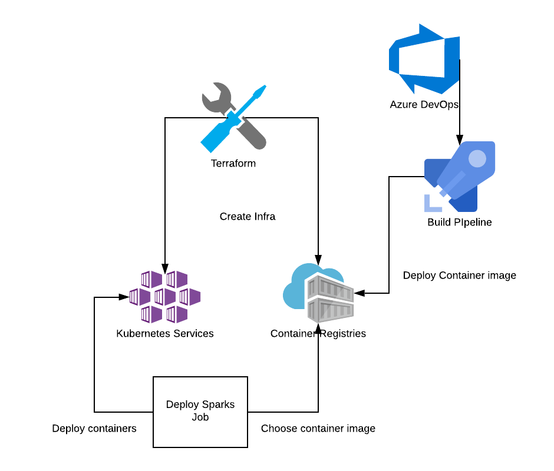

# Solution 2 - Infrastructure-as-Code

This is a more advanced solution. It can provide the necessary building blocks for more advanced scenarios, where you need heavy customization and/or control.

This solution builds most of the infrastructure needed to run an Apache Spark cluster. It starts by building the Kubernetes cluster with a private Container Registry. Once the cluster is done, you need to set up the cluster information in order to work with Spark and ACR.

An Azure DevOps Build pipeline template was also provided, in order to automate the building of the base Spark container image. This way you can tweak all the parameters and tooling on your Spark workers. It's using the public repo, so you can trigger it by branch release.



---

## Requirements

* Azure Account
* Azure DevOps Account
* PowerShell and Azure CLI
* [Terraform 0.12.X](https://www.terraform.io/)
* [Kubectl](https://kubernetes.io/docs/tasks/tools/install-kubectl/)
* Ssh-Keygen
* Docker (optional, if you want local testing)

---

## Setup

### PowerShell

You will need to download the [Azure CLI](https://docs.microsoft.com/en-us/cli/azure/install-azure-cli?view=azure-cli-latest)

### Terraform

You will need to install [Terraform](https://www.terraform.io/downloads.html)

### Credentials

To use Azure in a script you need to generate CLI credentials, that will include the *Azure Tenant ID*, *Azure Subscription ID*, *Azure App ID* and *Azure App Secret*.

On your PowerShell console, run the following command:

```powershell
az login
```

It will open a browser window where you will use your username and password, for your Azure account. If it is successful, it will show something like this:

```powershell
You have logged in. Now let us find all the subscriptions to which you have access...
[
  {
    "cloudName": "AzureCloud",
    "id": "xxx-xx-xxx-xxx",
    "isDefault": true,
    "name": "Free Trial",
    "state": "Enabled",
    "tenantId": "xxxx-xxxx-xxx-xxxx-xxxx",
    "user": {
      "name": "jo......@.....com",
      "type": "user"
    }
  }
]
```

Save the `id` field and `tenantId`. The `id` represents your *Subscription ID* and the `tenantId` represents your *Tenant ID.*

Then you'll need to create the *App Service Principal*. Run the following command:

```powershell
az ad sp create-for-rbac --role="Contributor" --scopes="/subscriptions/<subscription_id>"
```

If the operation is sucessful, the output will be something like this:

```json
{
  "appId": "xxx-xxxx-xxxx-xxxx-xxx-xxx",
  "displayName": "<service principal name>",
  "name": "http://<service principal name>",
  "password": "xxxxx--xxxx-xxxx-xxxx",
  "tenant": "xxxxx--xxxx-xxxx-xxxx"
}
```

Save the `appId` field and `password`. The `appId` represents your *Application ID* and the `password` represents your *Application Secret*.

Create a file with the following format:

```ini
subscription_id = "<Subscription ID>"
client_id = "<Application ID>"
client_secret = "<Password>"
tenant_id = "<Tenant ID>"
```

To test the credentials you can run the following command:

```powershell
az login --service-principal -u <client_id> -p <client_secret> --tenant <tenant_id>
```

**Note:** You may need to set yourself as the owner of the application. This should not be needed in an environment with Azure AD but if you're not able to access your resources after they are created, add your user as owner of the application. To do that, go to `Azure Active Directory > Enterprise Applications`, select *All Applications* and type your application name. On the owners tab, add your user to it.

### Private keys

Since the Kubernetes hosts are Linux VM's you'll need to generate the keys to access them. To do that run:

```powershell
mkdir Question_1\Solution_2\keys
ssh-keygen  # when asked set the name as container_key
            # don't use passphrases
```

---

## Creating the Azure Infrastructure

To deploy the infrastructure you'll need Terraform for the following steps. This will deploy a Kubernetes cluster and an Azure Container Registry (ACR).

Initialize and download the modules:

```powershell
terraform init
```

Test your configuration before deploying it. Don't forget to pass it the credentials file:

```powershell
terraform plan -var-file=<credentials_file>
```

The output should be similar to this:

```text
Refreshing Terraform state in-memory prior to plan...
The refreshed state will be used to calculate this plan, but will not be
persisted to local or remote state storage.


------------------------------------------------------------------------

An execution plan has been generated and is shown below.
Resource actions are indicated with the following symbols:
  + create

Terraform will perform the following actions:

  # azurerm_container_registry.container_registry will be created
  + resource "azurerm_container_registry" "container_registry" {
      + admin_enabled       = true
      + admin_password      = (sensitive value)
      + admin_username      = (known after apply)
      + id                  = (known after apply)
      + location            = "westeurope"
      + login_server        = (known after apply)
      + name                = "azcontregxpto"
      + network_rule_set    = (known after apply)
      + resource_group_name = "container_mgmt_rsgrp"
      + sku                 = "Basic"
      + tags                = (known after apply)
    }

  # azurerm_kubernetes_cluster.kubernetes will be created
  + resource "azurerm_kubernetes_cluster" "kubernetes" {
      + dns_prefix            = "kube-master-xpto"
      + fqdn                  = (known after apply)
      + id                    = (known after apply)
      + kube_admin_config     = (known after apply)
      + kube_admin_config_raw = (sensitive value)
      + kube_config           = (known after apply)
      + kube_config_raw       = (sensitive value)
      + kubernetes_version    = (known after apply)
      + location              = "westeurope"
      + name                  = "az-kube"
      + node_resource_group   = (known after apply)
      + resource_group_name   = "container_mgmt_rsgrp"
      + tags                  = (known after apply)

      + addon_profile {

          + http_application_routing {
              + enabled                            = true
              + http_application_routing_zone_name = (known after apply)
            }
        }

      + agent_pool_profile {
          + count           = 1
          + dns_prefix      = (known after apply)
          + fqdn            = (known after apply)
          + max_pods        = (known after apply)
          + name            = "k8sagpool"
          + os_disk_size_gb = 30
          + os_type         = "Linux"
          + type            = "AvailabilitySet"
          + vm_size         = "Standard_A2"
        }

      + linux_profile {
          + admin_username = "kube_master"

          + ssh_key {
              + key_data = "<KEY DATA>\r\n"
            }
        }

      + network_profile {
          + dns_service_ip     = (known after apply)
          + docker_bridge_cidr = (known after apply)
          + load_balancer_sku  = (known after apply)
          + network_plugin     = (known after apply)
          + network_policy     = (known after apply)
          + pod_cidr           = (known after apply)
          + service_cidr       = (known after apply)
        }

      + role_based_access_control {
          + enabled = (known after apply)

          + azure_active_directory {
              + client_app_id     = (known after apply)
              + server_app_id     = (known after apply)
              + server_app_secret = (sensitive value)
              + tenant_id         = (known after apply)
            }
        }

      + service_principal {
          + client_id     = "xxxx-xxxx-xxxxx-xxxx-xxxx"
          + client_secret = (sensitive value)
        }
    }

  # azurerm_resource_group.container_rg will be created
  + resource "azurerm_resource_group" "container_rg" {
      + id       = (known after apply)
      + location = "westeurope"
      + name     = "container_mgmt_rsgrp"
      + tags     = (known after apply)
    }

Plan: 3 to add, 0 to change, 0 to destroy.

------------------------------------------------------------------------

Note: You didn't specify an "-out" parameter to save this plan, so Terraform
can't guarantee that exactly these actions will be performed if
"terraform apply" is subsequently run.
```

Apply the configuration to your Azure cloud (don't forget to confirm it!!):

```powershell
terraform apply -var-file=<credentials_file>
```

This operation will take a while (~15 minutes) but in the end you'll have your Kubernetes cluster created. Terraform will print a lot of output but you don't have to worry about it now.

---

## Setting up the cluster

Before you start deploying Spark, there are some configurations you'll need to do on Kubernetes.

To start, you'll need to setup your Kubectl. This will allow you to control the entire cluster from your machine. To get the kube.config, run the following command:

```powershell
terraform output kube_cluster > .\kube.config
```

This will set the output of the raw kube.config, generated during the deploy, on a file called kube.config. You can either copy the file to your `~/.kube` directory, where Kubectl will read it by default, or you can append it to your commands.

To check your Kubernetes cluster, run:

```powershell
kubectl --kubeconfig=kube.config cluster-info
```

Now you'll need to create a service account and a role for Spark. To do this, apply the 2 templates provided:

* spark-servacc.yaml - Creates the role for Spark
* spark-role.yaml - Adds the role to edit the cluster

To do that, run the following commands:

```powershell
kubectl --kubeconfig=kube.config apply -f spark-servacc.yaml
kubectl --kubeconfig=kube.config apply -f spark-role.yaml
```

Next you'll need to create a Kubernetes secret. This is needed since we are using a private registry. If you were using public Docker Hub images, this step can be ignored.

To create the secret, run the following commands:

```powershell
$AcrLogin=terraform output container_registry_login_server
$AcrUser=terraform output container_registry_admin_username
$AcrPassword=terraform output container_registry_admin_password

kubectl --kubeconfig=kube.config create secret docker-registry acr-secret --docker-server $AcrLogin --docker-username $AcrUser --docker-password $AcrPassword
```

Note that we used the name **acr-secret** for our secret. Remember this name since this is important!

---

## Setting up the pipeline

For this next part, I'm going to assume you know how to setup an Azure DevOps organization and project. You will need to either fork this repo or just copy the `pipeline.yaml` file to your own repo.

Create the ACR connection by going to the [Service Accounts](https://dev.azure.com/ORGNAME/PROJECTNAME/_settings/adminservices) configuration. Press `New Service connection` and choose `Docker Registry service connection`. Select *Azure Container Registry*. It should detect your Azure account. Select your container registry, that was created with Terraform: *azcontregxpto*. Give it a name and save it. **Note:** By default, the name used was `ACR_CHALLENGE`. If you used a different name, you'll need to tweak the pipeline code. Remember the name!

Edit the `pipeline.yaml`and set up the variables `ACR_CONNECTION_NAME` (should be the name of your service connection) and `ACR_URL` (should be the the output from the command `terraform output container_registry_login_server`). You can also change the `BRANCH_NAME` if you want to use a different release of Spark.

Create a Build by going to `Pipelines > Builds` and pressing *New pipeline*. Select you repo type (in this case we choose GitHub). You'll have to confirm the permissions to access your account. For production use, it's advised to use a service account, since this will generate a PAT (Personal Access Token), for the user that creates the build.

Select the repo and the *Existing Azure Pipeline YAML file*. Set the path to it. In this case, the path is `Question_1/Solution_2/pipeline.yaml` on the master branch.

Review the yaml code and click Run to run and save it. The pipeline will start running. The compilation and container image generation can take a while (~30 minutes).

The trigger for a new build is a change on the pipeline code so, if you need a new version of the Spark container image, just change the branch variable and commit the changes.

---

## Deploying a Spark Job

Spark jobs are out of the scope for this challenge but we will describe here how you can send, using `spark-submit`, a job to run on the Kubernetes cluster.

To launch a job, run the following command:

```powershell
$K8sHost = terraform output kube_host
.\bin\spark-submit `
    --master k8s://$K8sHost `
    --deploy-mode cluster `
    --name <JOB_NAME> `
    --class <JOB_CLASS> `
    --conf spark.executor.instances=<NUM_EXECUTORS> `
    --conf spark.kubernetes.container.image=<SPARK_CONTAINER_IMG_NAME> `
    --conf spark.kubernetes.container.image.pullSecrets=<K8S_SECRET_NAME> `
    local://<PATH-TO-YOUR-JAR>.jar
```

---

## Cleanup

To delete all the resources generated in Azure, just run the destroy command on terraform (don't forget to confirm it):

```powershell
terraform destroy -var-file=<credentials_file>
```
